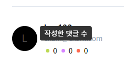

# Shaft

카테고리를 이용해 주제를 정하고 그에 맞는 토픽을 작성하여 의견을 나눌 수 있는 커뮤니티 (Vue 풀스택 프로젝트)

## 기술 스택

아래 기술 혹은 프레임워크, 라이브러리를 활용해서 만들었습니다.

- Nuxt
- Express
- MySQL
- TailwindCSS
- QuillEditor
- JSONWebToken

## 배포

로컬에서 Nuxt를 Universal Mode로 빌드한 후 [Google Cloud Platform](https://cloud.google.com/)에서 제공하는 Google App Engine에 배포했습니다. AWS의 Elastic Beanstalk와 비슷한 기능을 하는 서비스입니다.

## 인증

클라이언트에서 사용자 아이디와 비밀번호로 서버에 로그인 요청을 할 때, 성공하면 서버에서는 **Access Token**과 **Refresh Token** 두 개를 만듭니다. **Refresh Token**는 사용자 데이터베이스에 저장하고, **Access Token**을 클라이언트에게 발급합니다.

클라이언트는 서버로부터 받은 **Access Token**을 브라우저 저장소인 **LocalStorage**에 저장합니다. 클라이언트가 서버에 인증이 필요한 요청을 하면 이 **Access Token**과 함께 요청합니다. 서버에서는 해당 토큰이 만료되었는지, 아직 만료되지 않았는지를 판단하여 서버의 자원을 응답합니다.

만약, **Access Token**이 만료되었다면 데이터베이스에 저장해두었던 **Refresh Token**으로 **Access Token**을 발급합니다. **Refresh Token**까지 만료되었다면 클라이언트에게 적절한 오류로 응답하여 다시 로그인해야된다고 알려줍니다. 프로젝트에서는 토큰의 만료 기간을 각각 1시간과 1주일로 정했습니다.

기본적으로 자동 로그인을 사용해 처음 페이지에 접속 시 **Access Token**이 존재하면 서버에 자동으로 로그인 요청을 합니다.

## 구성

### 레이아웃

  

레이아웃은 헤더와 Sticky한 사이드 바, 컨텐츠 영역 그리고 Footer로 나누었습니다.

### 페이지

- `/` 경로에서 컨텐츠 영역은 모든 카테고리의 토픽들을 보여줍니다.
- `/users` 경로에서는 모든 유저들의 리스트를 보여줍니다.

이미지와 같이 작성한 댓글 수, 토픽에 좋아요를 받은 수, 토픽 작성 수를 마우스를 올리면 볼 수 있게 `tippy` 라이브러리를 이용해서 보여줍니다.

- `/topics/category`, `/topics/sub-category` 각 카테고리 번호로 분류된 토픽들을 보여줍니다.
- `/topics/:id` 토픽을 보여주는 경로입니다.
- `/topics/new` 토픽 작성/수정을 할 수 있는 경로입니다. 메인 토픽의 경우 카테고리를 지정할 수 있어 카테고리까지 수정할 수 있는 컴포넌트를 렌더링하지만 부모 토픽 아래에 있는 자식 토픽들은 카테고리를 지정할 수 없기 때문에 카테고리를 수정할 수 있는 컴포넌트를 렌더링하지 않습니다.

### API

아래와 같은 API를 가지도록 구성했습니다.

- `/api/auth/login` 로그인 **_POST_**
- `/api/auth/sign-up` 회원가입 **_POST_**
- `/api/auth/user` 유저 토큰/정보 확인 **_POST_**
- `/api/comments/new` 댓글 작성 **_POST_**
- `/api/comments/get/:id` 토픽 아이디로 댓글 가져오기 **_GET_**
- `/api/comments/update` 댓글 수정 **_PUT_**
- `/api/comments/delete/:id` 댓글 삭제 **_DELETE_**
- `/api/topics/new` 토픽 작성 **_POST_**
- `/api/topics/update/:id` 업데이트 된 토픽 가져오기 **_GET_**
- `/api/topics/update/:id` 토픽 수정 **_PUT_**
- `/api/topics/category` 모든 카테고리 가져오기 **_GET_**
- `/api/topics/category/:id` 토픽 아이디로 카테고리 가져오기 **_GET_**
- `/api/topics/:id` 토픽 아이디로 토픽 가져오기 **_GET_**
- `/api/topics` 모든 토픽 가져오기 **_GET_**
- `/api/topics/like` 토픽에 좋아요 누르기 **_PUT_**
- `/api/topics/:id` 토픽 삭제 **_DELETE_**
- `/api/users` 페이지 단위로 유저 정보 가져오기 **_GET_**
- `/api/users/:id` 유저 아이디로 유저 정보 가져오기 **_GET_**

### 미들웨어

모든 경로에서 인증 처리를 하면 코드가 복잡해지고 가독성이 떨어지기 때문에 인증이 필요한 경로에 미들웨어를 적용시켜 코드 구성을 깔끔하게 했습니다. 토큰이 필요한 모든 요청은 클라이언트 측에서 자동으로 토큰을 담아서 보내기 때문에 서버에서 유저의 토큰을 확인할 수 있습니다.

인증 미들웨어에서 토큰을 확인하고 토큰이 존재하지 않거나, 변조된 토큰이면 요청이 온 경로를 처리하기 전에 미들웨어에서 오류로 응답합니다. 토큰이 유효하면 요청이 온 경로로 이동하여 처리하고 응답합니다. 토큰이 만료되었다면 리프레쉬 토큰을 데이터베이스에서 꺼내와 액세스 토큰을 새로 만들고 응답 헤더에 `X-WWW-Access-Token`이라는 이름으로 토큰을 담습니다.

클라이언트 측에서 서버로 보내는 요청에서 서버의 응답에 해당 헤더가 존재한다면 기존의 `LocalStorage`에 저장되었던 액세스 토큰을 삭제하고 새롭게 발급받은 토큰으로 교체합니다.
